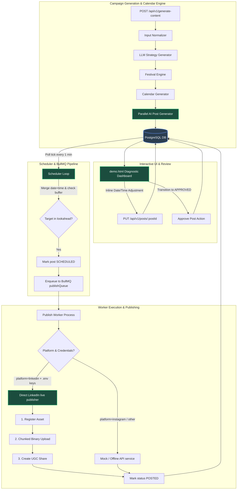

# Aladdyn Social Media Assistant: Project Status & AI Developer Handbook

Welcome! This document provides a complete, high-fidelity transmission of the **Aladdyn Social Worker / Content Generation & Scheduled Posting V2 Backend**. It serves as an exhaustive reference for any AI developer, team member, or system agent picking up this codebase.

---

## 🎯 Executive Project Identity & Purpose
**Aladdyn Social Worker** (internally known as **Social Scene Content Generation V2**) is a hyper-optimized, production-ready backend framework built to automate, schedule, composite, and publish rich, brand-tailored social media campaigns. 

Unlike conventional schedulers, it combines:
1. **Dynamic Content Pipelines**: Algorithmic input normalization, LLM-powered strategies, AI-driven topics calendars, and parallel caption/detailed-prompt engines.
2. **On-Demand Generation & OCR Sandwiches**: Playwright-based 3D CSS compositing engines, AI subject-masking cutouts (ONNX), and robust heuristic quality gates.
3. **Robust Posting Pipelines**: A resilient polling scheduler and BullMQ worker queue running atop PostgreSQL and Redis.
4. **Live Publishing Hooks**: Seamless direct binary chunk uploading and live UGC publishing to LinkedIn, with automated OAuth local auto-wiring helpers.

---

## 🛠️ Technology Stack
* **Language/Runtime**: Node.js, TypeScript (`npx tsx` for script executions)
* **API Framework**: Express.js
* **Database & ORM**: PostgreSQL (Neon Cloud Database) mapped via **Prisma**
* **Distributed Queue**: **BullMQ** running on a local **Redis Server** (Port `6379`)
* **Asset Storage**: **MinIO Object Storage** (local AWS S3 compatible bucket storage)
* **Compositor & Gating**: **Playwright** (headless Chromium browser), Google Fonts API, and **ONNX Subject Masking**
* **External APIs**: OpenRouter (GPT-4/Claude models for text), Replicate (FLUX), HuggingFace (RealismLora), DeepAI (text2img), LinkedIn UGC Share API

---

## 📐 Central System Architecture

The following diagram maps the comprehensive data lifecycle, from campaign requirements intake to direct scheduling, asset generation, visual verification, and platform publishing.



---

## 📁 Codebase Directory Walkthrough

```
/
├── demo.html               # Sleek interactive Diagnostic & Calendar Management Dashboard UI
├── package.json            # Scripts: dev, build, dev:cli, test:scheduled-posting etc.
├── prisma/
│   └── schema.prisma       # Prisma data model mapping Campaigns, Posts, Logs, and Strategies
├── docs/                   # Architectural blueprints and guides
│   ├── CACHING_IMPLEMENTATION.md   # Setup guide for caching services
│   ├── POST_MANAGEMENT_API.md      # API Reference for Campaign and Post mutations
│   ├── TESTING_CHECKLIST.md        # Comprehensive diagnostic checklist
│   └── ARCHITECTURE_FIXES_SUMMARY.md # Fix logs regarding topic deduplication and regeneration
└── src/
    ├── server.ts           # Primary Express.js REST API gateway with CRUD and testing routes
    ├── lib/
    │   └── prisma.ts       # Global Prisma client initializer
    ├── types/
    │   └── content.ts      # Strictly typed pipeline contracts & data interfaces
    ├── db/
    │   └── database.ts     # Postgres direct utility layer for raw/helper queries
    ├── jobs/
    │   ├── queues.ts       # BullMQ Queue setups (publishQueue, imageGenQueue, engagementPollQueue)
    │   ├── redis.ts        # Redis Client connector config
    │   ├── scheduler.ts    # Polling loop (auto-approver, LOOKAHEAD filter, and stuck-post sweeper)
    │   └── workers/
    │       ├── publishWorker.ts    # Enqueued job parser, routes platforms, tracks attempts
    │       └── imageGenWorker.ts   # Asynchronous prompt-to-image renderer worker
    ├── services/
    │   ├── linkedinPublisher.ts     # Live LinkedIn chunked binary uploader and UGC Publisher
    │   ├── instagramPublisher.ts    # Instagram Graph API mock and publisher route
    │   ├── generateImagePrompt.ts   # Detailed LLM visual prompt generator (200-400 words)
    │   ├── onDemandImageGeneration.ts # Manual image gen trigger service
    │   ├── subjectMasker.ts         # ONNX-powered AI foreground subject isolation
    │   ├── htmlRenderer.ts          # Playwright template compiler and 3D sandwich compositor
    │   └── qualityEvaluator.ts      # OCR visual scan, color sampler, and detail gatekeeper
    ├── test_linkedin_real.ts        # OAuth express receiver tool running on port 8080
    └── test_publish_flow_linkedin.ts # Pipeline scheduled-posting validator
```

---

## ⚡ Recent Major Diagnostics & Bug Fixes

### 1. The Critical Combined DateTime Scheduler Bug (Fixed)
* **The Issue**: Prisma's standard `DateTime` type maps date-only columns (e.g., `scheduledDate`) to UTC midnight (`00:00:00.000Z`). In parallel, scheduled post execution times (e.g., `"12:05"`) are stored as text in a separate column `scheduledTime`. Previously, the Scheduler queried posts where `scheduledDate <= now + buffer`. Because `scheduledDate` was at midnight, the scheduler compared midnight directly, resulting in either instant publishing of the entire campaign immediately upon generation, or scheduling errors.
* **The Resolution**: Implemented `getPostTargetDateTime()` in `src/jobs/scheduler.ts` to cleanly reconstruct the true absolute target date and time.
  ```typescript
  function getPostTargetDateTime(scheduledDate: Date, scheduledTime: string): Date {
    const target = new Date(scheduledDate);
    const [hours, minutes] = scheduledTime.split(':').map(Number);
    if (!isNaN(hours)) target.setHours(hours);
    if (!isNaN(minutes)) target.setMinutes(minutes);
    target.setSeconds(0);
    target.setMilliseconds(0);
    return target;
  }
  ```
  The scheduler now queries candidate posts in bulk, combines the midnight date and text time fields dynamically, filters posts against the `LOOKAHEAD_MINUTES` window, and calculates the exact execution `delay` for BullMQ. This ensures scheduled posts execute at the exact hour, minute, and second scheduled.

### 2. Live direct LinkedIn Integration (Fully Implemented)
* **The Issue**: Meta/Facebook Developer Apps are highly prone to immediate sandbox security suspensions. To allow end-to-end publishing tests, a robust, production-grade LinkedIn Share pipeline was built.
* **The Resolution**: Implemented `src/services/linkedinPublisher.ts` with direct support for the LinkedIn UGC Share endpoint, featuring full binary asset transfer:
  1. **Register Asset**: Handshakes with the LinkedIn media API to obtain an asset identifier and standard binary uploading uploadUrl.
  2. **Binary Chunk Stream**: Downloads raw graphic artifacts directly from Unsplash or local MinIO storage and pipelines them into a multi-part chunked `PUT` stream.
  3. **Publish UGC Share**: Constructs a complete, platform-compliant share object linking the newly uploaded binary image container.
* **Direct Worker Routing**: Modified `src/jobs/workers/publishWorker.ts` so that if direct LinkedIn credentials (`LINKEDIN_ACCESS_TOKEN` and `LINKEDIN_MEMBER_URN`) are present in `.env`, the worker bypasses the offline/mock API service, routing directly to live LinkedIn.

### 3. LinkedIn OAuth Auto-Wiring Receiver Tool (Fully Implemented)
* **The Issue**: Obtaining long-lived tokens and exact Member URNs is highly tedious.
* **The Resolution**: Created `src/test_linkedin_real.ts`, which runs a local Express server on port `8080`. Developers click a button, authenticate through standard LinkedIn OIDC, and the tool intercepts the auth-callback, exchanges it for a 60-day OAuth token, fetches the member profile (`/userinfo`), extracts the raw URN, and auto-writes them into `.env`.

### 4. Interactive Dates & Status Transitioning UI (Fully Implemented)
* **The Issue**: Posts generated had static scheduled date-time strings, and drafts were auto-posted immediately.
* **The Resolution**: Upgraded `demo.html` diagnostic dashboard and `src/server.ts` PUT endpoint:
  * Added **Manual Start/End Date Pickers** to the campaign generator form (defaulting to today and 14 days later).
  * Replaced static text card timestamps with **interactive, live inline Date & Time inputs** that auto-save mutations back to the Postgres database via `PUT /api/v1/posts/:postId` on `blur` or `change`.
  * Integrated a **`✅ Approve Post`** action flow. Newly generated posts are created in a `DRAFT` state. Clicking `Approve Post` transitions the status to `APPROVED`, scheduling it. Once approved, the card dynamically locks to a sleek blue `✓ Approved & Scheduled` state.

### 5. Premium Visual Overhaul: 3D Depth Watermarks & Layout Staging Protection (Fully Implemented)
* **The Issue**: Multiple visual visual constraints and alignment glitches were discovered during early asset reviews:
  * Standard/fallback slide templates rendered all elements in the primary headline color, washing out visual hierarchy.
  * Checklist rows staggered and shifted horizontally depending on card alignment (left/center/right), creating scattered checkmarks.
  * In product staging scenes, overlays collided with floor pedestals and products because flat floors mapped to very low occupancy variance.
  * The 3D depth sandwich effect was rarely activated since the safety guard pushed text in front of the cutout subject to prevent slicing/readability errors.
* **The Resolution**: Executed a complete premium styling polish across [htmlRenderer.ts](file:///C:/Users/shriy/OneDrive/Desktop/Projects/Aladdyn/social%20aladdyn/src/services/htmlRenderer.ts), [saliencyAnalyzer.ts](file:///C:/Users/shriy/OneDrive/Desktop/Projects/Aladdyn/social%20aladdyn/src/services/saliencyAnalyzer.ts), and [layoutDirector.ts](file:///C:/Users/shriy/OneDrive/Desktop/Projects/Aladdyn/social%20aladdyn/src/services/layoutDirector.ts):
  * **Gigantic 3D Sandwich Watermark**: Split the structural background elements from readable typography overlays. Created a stroke-outlined gigantic display watermark word (e.g. `"GLOW"`, `"SERUM"`) at `Z-10` behind the `Z-20` product cutout layer (which casts realistic shadows onto it), while keeping readable copy safely on `Z-30`.
  * **Color Contrast Hierarchy**: Mapped all fallback slide subtitles, feature card details, and standard checklist items to the softer `finalSubtitleColor`.
  * **Pristine Vertical Column Checklists**: Overhauled row components so that all checkmark badges align in a perfect, straight, vertical line by locking their layout to `align-items: flex-start; text-align: left;` while letting the card float cleanly.
  * **Spatial Pedestal Protection**: Added a bottom quadrant bias penalty (`+0.35`) in the saliency occupancy solvers to mathematically guide the computer vision layout solver to place text overlays in the upper wall negative spaces, leaving products fully clean and visible!
  * **Ultra-Premium Luxury Typography, Badges & CTA Upgrades (Fully Implemented)**:
    * **Cursive Typography Highlights**: Integrated a flowing, elegant cursive/handwriting Google Fonts system (`Caveat` and `Pacifico`) allowing the LLM Layout Director to wrap emotional core keywords inside headlines/subtitles in dual-tone script spans: `<span class="font-script text-accent-color">Community!</span>` or `<span class="font-script text-accent-color">Efficacy</span>`.
    * **Luxury Checklist Badge Upgrades**: Refactored the `renderIconBadge` service and layout director blueprints to support two custom premium modes: `"solid"` accent-colored circles with white outline icons, and `"double_ring"` concentric outlined circles with thin stroke outline icons.
    * **High-End Pill CTA Buttons**: Engineered CTA button templates to support premium pill shapes (`rounded-full`) containing a white leading circular indicator housing a brand-colored right action arrow (`→`).
    * **TypeScript & Schema Synchronization**: Synchronized these premium choices (`badgeStyle`, `ctaIconStyle`, `useScriptHighlight`) across Type contracts, the Headless Compositor engines, and the LLM Layout Director prompts.

---

## 📈 SocialPost Lifecycle States

Posts shift across distinct states managed by the scheduler and worker:

```
[DRAFT] (User edits post/date/time in demo.html)
   │
   ▼ (User clicks 'Approve Post' or scheduler auto-approves overdue drafts)
[APPROVED]
   │
   ▼ (Scheduler picks up post within 5-minute lookahead window)
[SCHEDULED] (Enqueued in BullMQ publishQueue with delay)
   │
   ▼ (BullMQ worker picks up job at the scheduled second)
[PUBLISHING] (Status locked, active network push)
   │
   ├───► [POSTED] (Successfully published to social network)
   └───► [FAILED] (Fatal error, publish error stored in DB)
```

---

## 🧪 Validating the Pipeline

### How to Run a Live Scheduler & Worker Timed LinkedIn Posting Test:
1. Ensure your Redis Server is running (`redis-server`).
2. Run the OAuth Helper script to write valid credentials into `.env`:
   ```bash
   npx tsx src/test_linkedin_real.ts
   ```
   Follow the CLI prompt, navigate to `http://localhost:8080` in your browser, authenticate, and close the browser once success is displayed.
3. Run the automated integration test script:
   ```bash
   npx tsx src/test_publish_flow_linkedin.ts
   ```
   This script:
   * Asserts PostgreSQL Neon database connection.
   * Asserts Redis Server is online.
   * Injects a temporary `SocialCampaign` and an `APPROVED` `SocialPost` scheduled precisely **1.5 minutes into the future**.
   * Boots the active Worker listener and executes the scheduler poll tick.
   * Verifies the Scheduler correctly combines date-time offsets, locks the status to `SCHEDULED`, and adds the BullMQ delayed job.
   * Waits for the delayed queue to fire, watches the Worker process the post, executes live LinkedIn chunk uploading, and transitions the database record to `POSTED` status.

---

## 🐞 Active Issues & Architectural Debugging Notes

1. **LinkedIn Profile OIDC Scope constraints**:
   * Newer LinkedIn apps block requests to OIDC `/userinfo` scopes (`openid profile email`) unless the **"Sign In with LinkedIn using OpenID Connect"** product is explicitly added under the "Products" tab in the LinkedIn Developer Portal. If this product is missing, `src/test_linkedin_real.ts` will fail to extract the Member URN, fallback templates will trigger, or OAuth authorization will fail.
2. **Meta App Suspensions & Sandbox Blocks**:
   * Direct Instagram Graph API is currently fully mocked (`src/services/instagramPublisher.ts`) due to sandbox constraints and Meta application suspension flags. Do not deploy direct Instagram uploads to production without performing complete App Review, business verification, and token exchange setups.
3. **Draft Auto-Approval Guard**:
   * Currently, `src/jobs/scheduler.ts` includes an auto-approval guard that automatically upgrades overdue `DRAFT` posts to `APPROVED` if their target time has passed. In a real-world environment, this auto-approval behavior might be undesirable since drafts should remain drafts until explicitly confirmed by the user.

---

## ⏳ Pending Implementation Items

The following architectural and operations improvements are pending to be fully implemented:

### 1. Standardize Custom Error Handling
* **The Problem**: Error handling throughout API controllers in `src/server.ts` is currently done via generic try-catch blocks and basic Express error middlewares. Some services throw raw strings while others throw custom error objects, leading to inconsistent JSON error structures.
* **The Task**:
  * Define a clean collection of specialized HTTP error classes inheriting from a base `AppError` in `src/middleware/errorHandler.ts` (e.g. `ValidationError`, `NotFoundError`, `UnauthorizedError`, `DatabaseError`).
  * Ensure all active controllers propagate errors through the global Express middleware `next(err)` instead of logging to console and returning ad-hoc responses.

### 2. Structured Logging Framework (Winston / Pino)
* **The Problem**: Code throughout the workers, services, and schedulers still relies on `console.log()` or basic console helpers. This makes centralized log aggregation (such as Datadog, Axiom, or Logtail) impossible in a multi-container environment.
* **The Task**:
  * Integrate a dedicated logger service using **Winston** or **Pino**.
  * Set up JSON-formatted stdout outputs in production, while retaining colorized, readable outputs during local development.
  * Standardize log metadata tags across the worker threads (e.g. `{ service: 'publish-worker', jobId: '...', postId: '...' }`).

### 3. Unit and Integration Testing Coverage
* **The Problem**: There are no formal unit testing configurations. While we have excellent script validators like `test_publish_flow_linkedin.ts`, we need standardized, repeatable test suites.
* **The Task**:
  * Configure **Jest** or **Vitest** for TypeScript.
  * Write isolated mock-tests for the LLM parsers (`generateTopics.ts`, `generateCaption.ts`).
  * Add unit tests to guarantee `getPostTargetDateTime()` accurately handles distinct time offsets (AM/PM string permutations, edge-case date intervals, and timezone offsets).

### 4. Interactive Live Preview & Prompt Editor
* **The Problem**: Currently, clicking `demo.html`'s card actions triggers a direct image generation process using the stored prompt, with no option for the developer or user to inspect or edit the detailed visual prompt beforehand.
* **The Task**:
  * Add an interactive modal in `demo.html` to preview the 200-400 word prompt generated by the LLM.
  * Provide an inline text-area to manually modify the prompt before calling the `POST /api/v1/posts/:postId/generate-image` endpoint.

---

## 📝 Transmission Verification Check

Ensure the following TypeScript check passes cleanly before attempting deployment:
```bash
npx tsc --noEmit
```
All system files compiled cleanly as of **May 25, 2026**.

*Handbook Compiled by Antigravity AI, Google DeepMind.*
