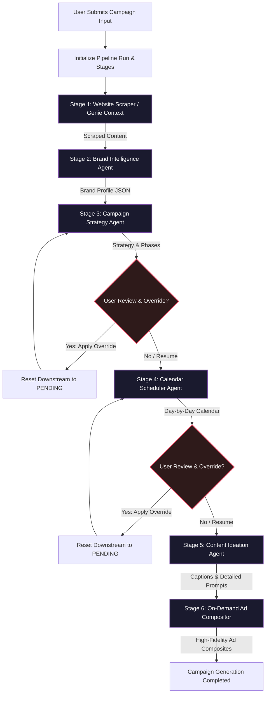
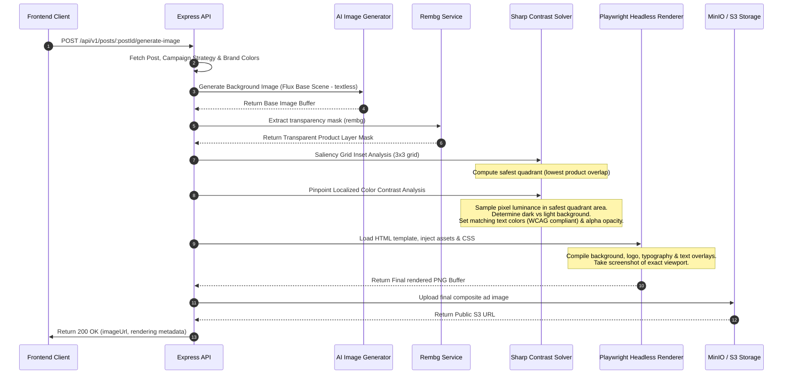

# 📐 System Architecture & Technical Design: Pipeline Modernization

This document provides the technical design, database extensions, data models, API endpoints, and sequence flows for upgrading the `social.aladdyn` content generation pipeline.

---

## 1. High-Level System Architecture

We transition from a simple "black-box" content generator to a structured, human-in-the-loop, multi-agent orchestrator. The pipeline is split into six decoupled, state-tracked stages:



---

## 2. Database Schema & Data Models

To support stage resumability, retry logging, and manual user overrides, we extend the Postgres schema using Prisma. We introduce two new models: `PipelineRun` and `PipelineStageOutput`.

```prisma
// ============================================================================
// PIPELINE TRACKING MODELS
// ============================================================================

enum PipelineStatus {
  PENDING
  RUNNING
  PAUSED
  COMPLETED
  FAILED
}

enum StageStatus {
  PENDING
  RUNNING
  COMPLETED
  FAILED
  OVERRIDDEN
}

model PipelineRun {
  id            String               @id @default(uuid())
  campaignId    String               @unique
  campaign      SocialCampaign       @relation(fields: [campaignId], references: [id], onDelete: Cascade)
  status        PipelineStatus       @default(PENDING)
  brandInput    Json                 // Serialized input parameters
  createdAt     DateTime             @default(now())
  startedAt     DateTime?
  completedAt   DateTime?
  stages        PipelineStageOutput[]

  @@map("pipeline_runs")
  @@schema("social")
}

model PipelineStageOutput {
  id            String         @id @default(uuid())
  runId         String
  pipelineRun   PipelineRun    @relation(fields: [runId], references: [id], onDelete: Cascade)
  stageName     String         // e.g., "genieContext", "brandIntelligence", "generateStrategy"
  status        StageStatus    @default(PENDING)
  outputJson    Json?          // Stored structured JSON from the LLM/Scraper
  errorMessage  String?        @db.Text
  attemptCount  Int            @default(0)
  completedAt   DateTime?

  @@unique([runId, stageName])
  @@map("pipeline_stage_outputs")
  @@schema("social")
}
```

---

## 3. On-Demand DTC-Grade Ad Compositor

When the user requests image generation for a post (`POST /api/v1/posts/:postId/generate-image`), the system executes a deterministic graphic-design layout pipeline:



### Saliency Analysis & Local Contrast Solving Formulas

#### 1. Grid Saliency Analysis
Split the transparent mask image ($1024 \times 1024$) into a $3 \times 3$ grid of equal sectors.
For each quadrant $Q_k$ ($k \in \{\text{top-left}, \text{top-right}, \text{bottom-left}, \text{bottom-right}\}$), calculate the **subject occupancy percentage** by counting occupied (non-transparent) pixels in the mask:
$$\text{Occupancy}(Q_k) = \frac{\sum_{(x,y) \in Q_k} [\text{Alpha}(x,y) > 30]}{\text{Total Pixels in } Q_k}$$

The quadrant with the **minimum** occupancy is selected as the **Safest Quadrant** for text overlays.

#### 2. Localized Relative Luminance
For the chosen safely inset quadrant bounding box, sample the background image pixels and calculate the Relative Luminance ($Y$) according to standard WCAG specifications:
$$Y = 0.2126R_{\text{srgb}} + 0.7152G_{\text{srgb}} + 0.0722B_{\text{srgb}}$$

Where $C_{\text{srgb}}$ is the linearized color component:
$$C_{\text{srgb}} = \begin{cases} \frac{C_{\text{srgb\_raw}}}{12.92} & \text{if } C_{\text{srgb\_raw}} \le 0.04045 \\ \left(\frac{C_{\text{srgb\_raw}} + 0.055}{1.055}\right)^{2.4} & \text{if } C_{\text{srgb\_raw}} > 0.04045 \end{cases}$$

* **Dark Background ($Y < 0.45$)**: Resolve text color to White (`#FFFFFF`).
* **Bright Background ($Y \ge 0.45$)**: Resolve text color to Deep Brand Base Color (`base_color`) or Black (`#111111`).
* **Adaptive Glass Overlay**: If standard deviation of luminance $\sigma_Y > 0.2$ (signifying high clutter/high contrast changes in the background quadrant), automatically add a frosted-glass backplate behind the text (`backdrop-filter: blur(12px)`) and scale the glass alpha opacity ($\alpha$) to:
  $$\alpha = \max(0.4, \min(0.8, \sigma_Y \times 2.5))$$

---

## 4. API Endpoint Specifications

To expose the resumable state machine and override abilities, we design three new Express routes:

### 4.1 Get Pipeline Run Status
* **Endpoint**: `GET /api/v1/campaigns/:campaignId/pipeline-run`
* **Response Status**: `200 OK`
* **Response Body**:
```json
{
  "success": true,
  "data": {
    "runId": "a3b9021c-cfb2-4d11-9a7f-bc3a918a221f",
    "campaignId": "4c8f0b7b-2321-49b4-b049-92c140938fdf",
    "status": "PAUSED",
    "stages": [
      {
        "stageName": "genieContext",
        "status": "COMPLETED",
        "completedAt": "2026-05-23T07:30:15Z"
      },
      {
        "stageName": "normalizeInput",
        "status": "COMPLETED",
        "completedAt": "2026-05-23T07:30:30Z"
      },
      {
        "stageName": "generateStrategy",
        "status": "COMPLETED",
        "completedAt": "2026-05-23T07:31:10Z",
        "outputJson": {
          "content_pillars": ["Educational Tips", "Customer Reviews", "DTC Promotion"],
          "tone": "Warm and premium",
          "cta_style": "Soft Sell",
          "content_mix": { "education": 40, "trust": 40, "promotion": 20 }
        }
      },
      {
        "stageName": "generateCalendar",
        "status": "PENDING"
      }
    ]
  }
}
```

### 4.2 Apply Stage Override (Invalidating Downstream)
* **Endpoint**: `POST /api/v1/campaigns/:campaignId/stages/:stageName/override`
* **Request Body**:
```json
{
  "outputJson": {
    "content_pillars": ["Educational Tips", "Customer Reviews", "DTC Promotion"],
    "tone": "Empathetic, premium, scientific",
    "cta_style": "Direct",
    "content_mix": { "education": 30, "trust": 40, "promotion": 30 }
  }
}
```
* **Process**:
  1. Updates the `generateStrategy` stage output in the DB, marking status as `OVERRIDDEN`.
  2. Runs a query to invalidate all downstream stages (`generateCalendar`, `generatePosts`), updating their status to `PENDING` and resetting `outputJson` to `null`.
  3. Pauses the pipeline run (`status = PAUSED`) and returns the updated run state.

### 4.3 Resume Pipeline Execution
* **Endpoint**: `POST /api/v1/campaigns/:campaignId/pipeline-run/resume`
* **Process**:
  1. Fetches the `PipelineRun` and matches the first stage with status `PENDING` or `FAILED`.
  2. Spawns the background task to execute from that stage forward, passing the upstream outputs (including any customized overridden JSONs) down as inputs.
