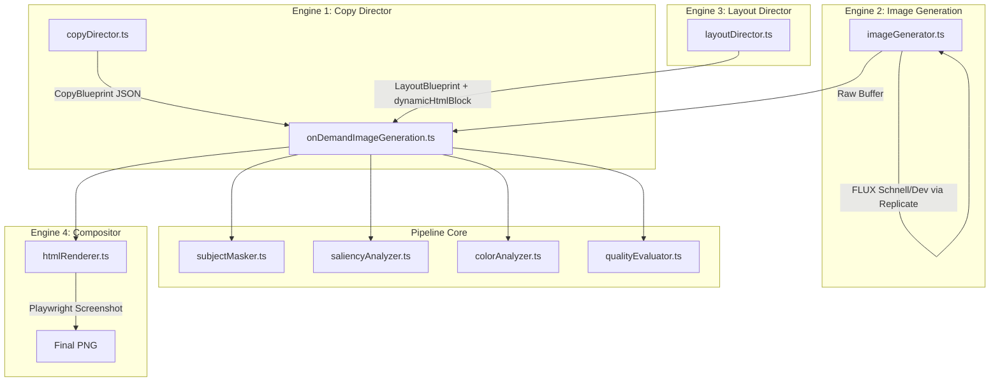
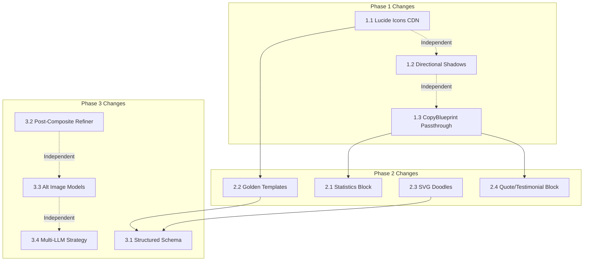

# 🏗️ Detailed Implementation Blueprint: Reference-Quality Ad Creatives

> **Purpose**: A self-contained, exhaustively detailed reference document for future implementation. Every change includes exact file paths, line numbers, code snippets, type definitions, and integration wiring.

---

## Architecture Map (Current State)



### Key Files Reference Table

| File | Path | Lines | Role |
|------|------|-------|------|
| Copy Director | [copyDirector.ts](file:///C:/Users/shriy/OneDrive/Desktop/Projects/Aladdyn/social%20aladdyn/src/services/copyDirector.ts) | 97 | LLM copywriter → structured JSON text nodes |
| Layout Director | [layoutDirector.ts](file:///C:/Users/shriy/OneDrive/Desktop/Projects/Aladdyn/social%20aladdyn/src/services/layoutDirector.ts) | 332 | LLM layout engineer → HTML blueprint + design tokens |
| HTML Renderer | [htmlRenderer.ts](file:///C:/Users/shriy/OneDrive/Desktop/Projects/Aladdyn/social%20aladdyn/src/services/htmlRenderer.ts) | 644 | Playwright compositor → multi-layer screenshot |
| Image Generator | [imageGenerator.ts](file:///C:/Users/shriy/OneDrive/Desktop/Projects/Aladdyn/social%20aladdyn/src/services/imageGenerator.ts) | 651 | FLUX via Replicate/HuggingFace → raw background |
| Pipeline Core | [onDemandImageGeneration.ts](file:///C:/Users/shriy/OneDrive/Desktop/Projects/Aladdyn/social%20aladdyn/src/services/onDemandImageGeneration.ts) | 646 | Orchestrator wiring all engines together |
| Saliency Analyzer | [saliencyAnalyzer.ts](file:///C:/Users/shriy/OneDrive/Desktop/Projects/Aladdyn/social%20aladdyn/src/services/saliencyAnalyzer.ts) | 143 | Sharp-based 3x3 grid occupancy scoring |
| Color Analyzer | [colorAnalyzer.ts](file:///C:/Users/shriy/OneDrive/Desktop/Projects/Aladdyn/social%20aladdyn/src/services/colorAnalyzer.ts) | 144 | WCAG luminance + contrast-safe color solving |
| Quality Evaluator | [qualityEvaluator.ts](file:///C:/Users/shriy/OneDrive/Desktop/Projects/Aladdyn/social%20aladdyn/src/services/qualityEvaluator.ts) | 151 | Stdev + OCR + brand color distance gate |
| Subject Masker | [subjectMasker.ts](file:///C:/Users/shriy/OneDrive/Desktop/Projects/Aladdyn/social%20aladdyn/src/services/subjectMasker.ts) | 75 | @imgly ONNX background removal |
| Content Types | [content.ts](file:///C:/Users/shriy/OneDrive/Desktop/Projects/Aladdyn/social%20aladdyn/src/types/content.ts) | 298 | CopyBlueprint, CopyBlueprintElement, etc. |

### Current Environment Configuration
```
LLM_MODEL="llama-3.3-70b-versatile"     # Groq
IMAGE_PROVIDER="replicate"
REPLICATE_IMAGE_MODEL="black-forest-labs/flux-dev"  # Already upgraded from schnell
```

---

# Phase 1: Quick Wins (2-4 hours each)

---

## 1.1 — Professional SVG Icon System (Lucide Icons)

### Problem
[parseFeature()](file:///C:/Users/shriy/OneDrive/Desktop/Projects/Aladdyn/social%20aladdyn/src/services/htmlRenderer.ts#L190-L230) uses emoji (`✓`, `✕`, Unicode pictographics) for all feature list badges. These render as low-res bitmap glyphs in Playwright and look amateurish next to the reference's clean SVG icon circles.

### Root Cause
No SVG icon library is loaded in the Playwright HTML template. The system was designed with emoji as the only icon vocabulary.

### Before → After
```
BEFORE: ✓ 100% Vegan Actives          (emoji checkmark, inconsistent sizing)
AFTER:  [🔬] 100% Vegan Actives       (Lucide SVG "flask-conical" in a soft circle)
```

### Step 1: Add Lucide CDN to Playwright HTML Template

**File**: [htmlRenderer.ts](file:///C:/Users/shriy/OneDrive/Desktop/Projects/Aladdyn/social%20aladdyn/src/services/htmlRenderer.ts#L544-L561)

In the `<head>` section of the HTML template (around line 548-560), add the Lucide CDN script **after** Tailwind:

```html
<!-- ADD after line 560 (after Tailwind CDN script) -->
<script src="https://unpkg.com/lucide@latest/dist/umd/lucide.js"></script>
```

Then at the **bottom** of the `<body>` (before `</body>` at line 610), add the initialization call:

```html
<!-- ADD before </body> at line 610 -->
<script>lucide.createIcons();</script>
```

### Step 2: Extend CopyBlueprintElement Type

**File**: [content.ts](file:///C:/Users/shriy/OneDrive/Desktop/Projects/Aladdyn/social%20aladdyn/src/types/content.ts#L286-L290)

```diff
 export interface CopyBlueprintElement {
   type: 'feature' | 'quote' | 'statistic' | 'badge' | 'paragraph' | 'cta';
   text: string;
   icon?: string; // Optional emoji or symbol
+  iconName?: string; // Lucide icon name (e.g., 'brain', 'shield-check', 'zap', 'heart')
+  value?: string; // For statistics: the big number (e.g., '40%', '100+', '3x')
 }
```

### Step 3: Update Copy Director Prompt to Output iconName

**File**: [copyDirector.ts](file:///C:/Users/shriy/OneDrive/Desktop/Projects/Aladdyn/social%20aladdyn/src/services/copyDirector.ts#L44-L57)

Replace the OUTPUT FORMAT section of the prompt (lines 44-57):

```
REQUIRED OUTPUT FORMAT (Return ONLY valid JSON):
{
  "intent": "Identify the core intent (e.g., EDUCATIONAL, COMPARISON, TESTIMONIAL, PROMOTIONAL, PRODUCT_HIGHLIGHT)",
  "primaryHeadline": "A 2-6 word powerful headline. E.g., 'The Science of Glow'",
  "secondarySubtitle": "A 1-2 sentence compelling subheadline.",
  "elements": [
    {
      "type": "feature | quote | statistic | badge | paragraph | cta",
      "text": "The actual text",
      "icon": "A relevant emoji (optional, use sparingly)",
      "iconName": "A Lucide icon name that visually represents this element. Choose from: shield-check, zap, brain, heart, star, award, target, trending-up, clock, users, globe, sparkles, check-circle, flask-conical, leaf, sun, eye, lock, rocket, bar-chart-2, palette, gem, crown, thumbs-up, lightbulb, microscope, droplets, wind, flame, layers, box, cpu, database, wifi, cloud, smartphone, calendar, gift, truck, credit-card, shopping-bag, tag, percent, message-circle, phone, mail, map-pin, briefcase, graduation-cap, book-open, pen-tool, scissors, camera, music, play-circle, volume-2, headphones, monitor, tablet, watch, battery-charging, power, settings, tool, wrench, hammer, key, shield, umbrella, thermometer, activity, pie-chart, line-chart, refresh-cw, download, upload, external-link, link, paperclip, file-text, folder, archive, trash-2, edit, copy, save, printer, search, filter, maximize, minimize, grid, list, layout, sidebar, menu, more-horizontal, chevron-right, arrow-right, arrow-up-right, corner-down-right, move, navigation, compass, crosshair, map",
      "value": "For statistics only: the big number like '40%' or '100+' or '3x'"
    }
  ]
}
```

### Step 4: Create Icon Renderer Helper Function

**File**: [htmlRenderer.ts](file:///C:/Users/shriy/OneDrive/Desktop/Projects/Aladdyn/social%20aladdyn/src/services/htmlRenderer.ts) — add new function after `parseFeature()` (after line 230):

```typescript
/**
 * Renders a premium circular icon badge using Lucide SVG icons.
 * Falls back to emoji or checkmark if no iconName is provided.
 */
function renderIconBadge(params: {
  iconName?: string;
  emoji?: string;
  isNegative?: boolean;
  accentColor: string;
  isDarkBg: boolean;
  size?: number; // badge diameter in px, default 36
}): string {
  const { iconName, emoji, isNegative, accentColor, isDarkBg, size = 36 } = params;
  const iconSize = Math.round(size * 0.5);
  
  // Determine badge background
  const bgColor = isNegative
    ? 'rgba(239, 68, 68, 0.15)'  // soft red
    : isDarkBg
      ? `${accentColor}22`       // accent with 13% opacity on dark
      : `${accentColor}18`;      // accent with 9% opacity on light
  
  const borderColor = isNegative
    ? 'rgba(239, 68, 68, 0.25)'
    : isDarkBg
      ? `${accentColor}40`       // accent with 25% opacity
      : `${accentColor}30`;
  
  const iconColor = isNegative ? '#EF4444' : accentColor;
  
  if (iconName) {
    // Lucide SVG icon badge
    return `<div style='display: flex !important; align-items: center !important; justify-content: center !important; flex-shrink: 0 !important; width: ${size}px !important; height: ${size}px !important; border-radius: 50% !important; background: ${bgColor}; border: 1px solid ${borderColor};'>
      <i data-lucide='${iconName}' style='width: ${iconSize}px; height: ${iconSize}px; color: ${iconColor}; stroke-width: 2;'></i>
    </div>`;
  } else if (emoji) {
    // Emoji badge
    return `<div style='display: flex !important; align-items: center !important; justify-content: center !important; flex-shrink: 0 !important; width: ${size}px !important; height: ${size}px !important; border-radius: 50% !important; background: ${bgColor}; border: 1px solid ${borderColor};'>
      <span style='font-size: ${iconSize}px; line-height: 1;'>${emoji}</span>
    </div>`;
  } else {
    // Fallback checkmark/cross
    const symbol = isNegative ? '✕' : '✓';
    return `<div style='display: flex !important; align-items: center !important; justify-content: center !important; flex-shrink: 0 !important; width: ${size}px !important; height: ${size}px !important; border-radius: 50% !important; background: ${bgColor}; border: 1px solid ${borderColor}; color: ${iconColor}; font-weight: 900; font-size: 14px;'>
      ${symbol}
    </div>`;
  }
}
```

### Step 5: Wire Icon Badges into Feature List Rendering

**File**: [htmlRenderer.ts](file:///C:/Users/shriy/OneDrive/Desktop/Projects/Aladdyn/social%20aladdyn/src/services/htmlRenderer.ts#L446-L481)

The current feature list rendering (lines 446-481) uses `parseFeature()` and builds `<li>` elements with emoji/checkmark badges. Refactor to use `renderIconBadge()`:

- Pass `copyBlueprint.elements` array into the renderer alongside `featureList`
- For each feature, look up matching element from the CopyBlueprint to get the `iconName`
- Call `renderIconBadge({ iconName, emoji: parsed.icon, isNegative: parsed.isNegative, accentColor: finalAccentColor, isDarkBg: colors.isDarkBg })`

### Step 6: Update Layout Director Prompt

**File**: [layoutDirector.ts](file:///C:/Users/shriy/OneDrive/Desktop/Projects/Aladdyn/social%20aladdyn/src/services/layoutDirector.ts#L94-L278)

In the Layout Director's mega-prompt, add a section teaching it about Lucide icons:

```
ICON SYSTEM:
The HTML template has Lucide Icons loaded via CDN. You can use any Lucide icon in your dynamicHtmlBlock using:
  <i data-lucide='icon-name' style='width: 20px; height: 20px; color: ${headlineColor};'></i>
  
Common useful icons: shield-check, zap, brain, heart, star, award, target, trending-up, clock, users, sparkles, flask-conical, leaf, check-circle, rocket, bar-chart-2, gem, crown, lightbulb, droplets, layers

Wrap icons in circular badges for a premium look:
  <div style='width: 40px; height: 40px; border-radius: 50%; background: rgba(139,92,246,0.15); border: 1px solid rgba(139,92,246,0.3); display: flex; align-items: center; justify-content: center;'>
    <i data-lucide='brain' style='width: 20px; height: 20px; color: #8B5CF6;'></i>
  </div>
```

### Step 7: Wait for Lucide Initialization in Playwright

**File**: [htmlRenderer.ts](file:///C:/Users/shriy/OneDrive/Desktop/Projects/Aladdyn/social%20aladdyn/src/services/htmlRenderer.ts#L614-L626)

After the existing Tailwind wait logic (lines 619-625), add a Lucide icon rendering wait:

```typescript
// ADD after line 625 (after Tailwind wait)
// Wait for Lucide icons to initialize and render SVGs
await page.evaluate(() => {
  if (typeof (window as any).lucide !== 'undefined') {
    (window as any).lucide.createIcons();
  }
  return new Promise(resolve => setTimeout(resolve, 300));
});
```

### Testing
- Generate a post with `contentPillar: "Product Education"` 
- Check that feature list items have SVG circle badges instead of emoji
- Verify icons render at correct size (not clipped, not oversized)
- Screenshot comparison: old emoji vs new SVG badges

---

## 1.2 — Enhanced Directional Shadow System

### Problem
Text overlays look flat and foreign because the text-shadow direction doesn't match the scene's lighting. Currently uses a generic `text-shadow: 0 2px 4px rgba(0,0,0,0.85)` everywhere.

### Root Cause
The [colorAnalyzer.ts](file:///C:/Users/shriy/OneDrive/Desktop/Projects/Aladdyn/social%20aladdyn/src/services/colorAnalyzer.ts) only computes average luminance and clutter standard deviation. It does NOT analyze lighting direction (where the bright/dark zones are relative to each other).

### Step 1: Add Light Direction Analysis to Color Analyzer

**File**: [colorAnalyzer.ts](file:///C:/Users/shriy/OneDrive/Desktop/Projects/Aladdyn/social%20aladdyn/src/services/colorAnalyzer.ts)

Add a new field to `ColorMetrics` interface (line 6-18):

```diff
 export interface ColorMetrics {
   headlineColor: string;
   subtitleColor: string;
   isDarkBg: boolean;
   bgOpacityOverride: number;
+  /** Estimated dominant light direction based on luminance gradient across quadrants */
+  lightDirection: {
+    /** Horizontal: -1 (light from left) to +1 (light from right) */
+    horizontal: number;
+    /** Vertical: -1 (light from top) to +1 (light from bottom) */
+    vertical: number;
+  };
 }
```

Add the analysis logic at the end of `analyzeLocalColors()` function, before the `return` statement (around line 126):

```typescript
// 5. Estimate dominant light direction from full image luminance gradient
let lightHorizontal = 0;
let lightVertical = 0;
try {
  // Sample 4 edge strips of the full image
  const fullImage = sharp(imageBuffer);
  const fullMeta = await fullImage.metadata();
  const fw = fullMeta.width || 1024;
  const fh = fullMeta.height || 1024;
  const stripSize = Math.floor(fw * 0.25);
  
  const sampleStrip = async (left: number, top: number, w: number, h: number) => {
    const strip = await sharp(imageBuffer)
      .extract({ left, top, width: w, height: h })
      .greyscale()
      .stats();
    return strip.channels[0].mean / 255; // normalize to 0-1
  };
  
  const leftLum = await sampleStrip(0, 0, stripSize, fh);
  const rightLum = await sampleStrip(fw - stripSize, 0, stripSize, fh);
  const topLum = await sampleStrip(0, 0, fw, stripSize);
  const bottomLum = await sampleStrip(0, fh - stripSize, fw, stripSize);
  
  lightHorizontal = rightLum - leftLum; // positive = light from right
  lightVertical = bottomLum - topLum;   // positive = light from bottom
  
  logger.info(`Light direction estimated: H=${lightHorizontal.toFixed(3)}, V=${lightVertical.toFixed(3)}`);
} catch (e) {
  logger.warn(`Light direction analysis failed, defaulting to top-left. ${e}`);
}
```

Update the return statement to include `lightDirection`:

```typescript
return {
  headlineColor: isDark ? '#FFFFFF' : '#111111',
  subtitleColor: isDark ? '#E2E8F0' : '#1E293B',
  isDarkBg: isDark,
  bgOpacityOverride,
  lightDirection: {
    horizontal: lightHorizontal,
    vertical: lightVertical
  }
};
```

Update the fallback return (line 137) similarly:

```typescript
return {
  headlineColor: '#FFFFFF',
  subtitleColor: '#E2E8F0',
  isDarkBg: true,
  bgOpacityOverride: 0.5,
  lightDirection: { horizontal: -0.1, vertical: -0.1 }
};
```

### Step 2: Generate Directional Shadows in HTML Renderer

**File**: [htmlRenderer.ts](file:///C:/Users/shriy/OneDrive/Desktop/Projects/Aladdyn/social%20aladdyn/src/services/htmlRenderer.ts#L425-L440)

Replace the current fixed shadow logic (lines 434-439) with directional shadows:

```typescript
// After line 433 (inside the requireGlassmorphism === false block)
// Compute directional text shadows that match the scene's lighting
const lightH = colors.lightDirection?.horizontal || -0.1;
const lightV = colors.lightDirection?.vertical || -0.1;

// Shadow offset opposes the light source (shadow falls away from light)
const shadowOffsetX = Math.round(-lightH * 6); // -6px to +6px
const shadowOffsetY = Math.round(-lightV * 6) + 2; // baseline 2px down

const shadowColor = colors.isDarkBg ? 'rgba(0,0,0,0.85)' : 'rgba(255,255,255,0.85)';
const diffuseColor = colors.isDarkBg ? 'rgba(0,0,0,0.45)' : 'rgba(255,255,255,0.45)';

const textShadowCss = `text-shadow: ${shadowOffsetX}px ${shadowOffsetY}px 4px ${shadowColor}, ${shadowOffsetX * 2}px ${shadowOffsetY * 2}px 16px ${diffuseColor};`;

headlineSizeStyle += ` ${textShadowCss}`;
subtitleSizeStyle += ` ${textShadowCss}`;
```

### Step 3: Pass Light Direction Through Pipeline

**File**: [onDemandImageGeneration.ts](file:///C:/Users/shriy/OneDrive/Desktop/Projects/Aladdyn/social%20aladdyn/src/services/onDemandImageGeneration.ts)

The `colors` object is already passed through to `renderAdComposite()`. Since we added `lightDirection` to the `ColorMetrics` interface, it will automatically flow through. No wiring changes needed.

However, update the `RenderParams.colors` type in [htmlRenderer.ts](file:///C:/Users/shriy/OneDrive/Desktop/Projects/Aladdyn/social%20aladdyn/src/services/htmlRenderer.ts#L35-L40):

```diff
   colors: {
     headlineColor: string;
     subtitleColor: string;
     isDarkBg: boolean;
     bgOpacityOverride: number;
+    lightDirection?: {
+      horizontal: number;
+      vertical: number;
+    };
   };
```

### Testing
- Generate the same post twice, once with a left-lit scene and once with a right-lit scene
- Verify shadow direction changes accordingly
- Check that shadows don't clip text at extreme angles

---

## 1.3 — CopyBlueprint Element Passthrough to Renderer

### Problem
The Copy Director outputs structured elements with `type`, `text`, `icon`, and (after our changes) `iconName` and `value`. But the HTML renderer never receives the full `CopyBlueprint` — it only gets `headline`, `subtitle`, `cta`, and `featureList` (extracted from `bp.features`).

This means the renderer has no idea if an element is a `statistic`, `quote`, `badge`, or `feature`. They're all rendered identically.

### Step 1: Pass CopyBlueprint to the HTML Renderer

**File**: [htmlRenderer.ts](file:///C:/Users/shriy/OneDrive/Desktop/Projects/Aladdyn/social%20aladdyn/src/services/htmlRenderer.ts#L6-L88)

Add to `RenderParams` interface:

```diff
+  /** Structured copy elements from the Copy Director */
+  copyElements?: Array<{
+    type: 'feature' | 'quote' | 'statistic' | 'badge' | 'paragraph' | 'cta';
+    text: string;
+    icon?: string;
+    iconName?: string;
+    value?: string;
+  }>;
```

### Step 2: Wire CopyBlueprint.elements in Pipeline

**File**: [onDemandImageGeneration.ts](file:///C:/Users/shriy/OneDrive/Desktop/Projects/Aladdyn/social%20aladdyn/src/services/onDemandImageGeneration.ts)

In the single-post `renderAdComposite()` call (around line 558-582), add:

```diff
 const compositePngBuffer = await renderAdComposite({
   ...
   topic: post.topic || undefined,
+  copyElements: copyBlueprint?.elements || [],
   layoutBlueprint: layoutBlueprint ? { ... } : { ... }
 });
```

Same for the carousel slide render call (around line 513-533):

```diff
 const slideBuffer = await renderAdComposite({
   ...
   topic: post.topic || undefined,
+  copyElements: slideCopyBlueprint?.elements || [],
   layoutBlueprint: slideBlueprint
 });
```

---

# Phase 2: Structural Improvements (4-8 hours each)

---

## 2.1 — Statistics Block Component

### Problem
Reference ads display metrics like "40% Improvement", "100+ Plans", "3x Better" as beautiful large-number stat cards in a horizontal grid. Our pipeline treats `statistic` elements identically to `paragraph` elements.

### Step 1: Create Statistics Renderer Function

**File**: [htmlRenderer.ts](file:///C:/Users/shriy/OneDrive/Desktop/Projects/Aladdyn/social%20aladdyn/src/services/htmlRenderer.ts) — add new function:

```typescript
/**
 * Renders a premium statistics grid block from CopyBlueprint statistic elements.
 * Creates a horizontal row of large-number-small-label metric cards.
 */
function renderStatisticsBlock(params: {
  stats: Array<{ value: string; text: string; iconName?: string }>;
  accentColor: string;
  headlineColor: string;
  subtitleColor: string;
  headlineFont: string;
  subtitleFont: string;
  isDarkBg: boolean;
}): string {
  if (params.stats.length === 0) return '';
  
  const { accentColor, headlineColor, subtitleColor, headlineFont, subtitleFont, isDarkBg } = params;
  
  const columns = Math.min(params.stats.length, 3); // max 3 columns
  const statItems = params.stats.slice(0, 3).map(stat => {
    const iconHtml = stat.iconName
      ? `<i data-lucide='${stat.iconName}' style='width: 18px; height: 18px; color: ${accentColor}; margin-bottom: 8px;'></i>`
      : '';
    
    return `
      <div style='display: flex; flex-direction: column; align-items: center; text-align: center; flex: 1; padding: 16px 8px;'>
        ${iconHtml}
        <div style='font-family: ${headlineFont}, sans-serif; font-size: 2.5rem; font-weight: 900; line-height: 1; color: ${accentColor}; letter-spacing: -0.02em;'>
          ${stat.value}
        </div>
        <div style='font-family: ${subtitleFont}, sans-serif; font-size: 0.75rem; font-weight: 600; color: ${subtitleColor}; margin-top: 6px; text-transform: uppercase; letter-spacing: 0.08em; opacity: 0.85;'>
          ${stat.text}
        </div>
      </div>
    `;
  }).join(`<div style='width: 1px; background: ${isDarkBg ? 'rgba(255,255,255,0.12)' : 'rgba(0,0,0,0.08)'}; align-self: stretch; margin: 8px 0;'></div>`);
  
  return `
    <div style='display: flex; flex-direction: row; align-items: stretch; justify-content: center; width: 100%; margin-top: 12px; padding: 8px 0; border-radius: 16px; background: ${isDarkBg ? 'rgba(255,255,255,0.06)' : 'rgba(0,0,0,0.03)'}; border: 1px solid ${isDarkBg ? 'rgba(255,255,255,0.08)' : 'rgba(0,0,0,0.05)'};'>
      ${statItems}
    </div>
  `;
}
```

### Step 2: Integrate into Main Render Function

**File**: [htmlRenderer.ts](file:///C:/Users/shriy/OneDrive/Desktop/Projects/Aladdyn/social%20aladdyn/src/services/htmlRenderer.ts)

In the `renderAdComposite()` function, after `featureListHtml` is built (around line 481), add:

```typescript
// Render statistics blocks from CopyBlueprint elements
let statisticsHtml = '';
if (copyElements && copyElements.length > 0) {
  const statElements = copyElements.filter(el => el.type === 'statistic' && el.value);
  if (statElements.length > 0) {
    statisticsHtml = renderStatisticsBlock({
      stats: statElements.map(el => ({
        value: el.value!,
        text: el.text,
        iconName: el.iconName
      })),
      accentColor: finalAccentColor,
      headlineColor: finalTextColor,
      subtitleColor: finalSubtitleColor,
      headlineFont: headlineFont,
      subtitleFont: subtitleFont,
      isDarkBg: colors.isDarkBg
    });
  }
}
```

Then insert `${statisticsHtml}` into the HTML template (around line 589, after `${comparisonHtml}`):

```html
<!-- Statistics Metrics Grid -->
${statisticsHtml}
```

### Testing
- Create a post with topic "Our Impact in Numbers"
- Verify Copy Director outputs elements with `type: "statistic"` and `value: "40%"`
- Check that stat grid renders as horizontal cards with large numbers

---

## 2.2 — Golden Layout Templates System

### Problem
The Layout Director generates raw HTML in `dynamicHtmlBlock` via LLM. This is:
1. **Fragile** — JSON escaping breaks, font-family quotes cause parse failures (we already have a [sanitizer](file:///C:/Users/shriy/OneDrive/Desktop/Projects/Aladdyn/social%20aladdyn/src/services/htmlRenderer.ts#L347-L353) patching this)
2. **Inconsistent** — quality varies wildly between LLM runs
3. **Slow** — the LLM has to generate 1-2KB of HTML per post

### Solution Architecture
Create 6-8 **pre-built, pixel-perfect HTML template functions** that the Layout Director can select from. The LLM outputs a `templateId` + structured parameters, and the renderer calls the corresponding template function.

### Step 1: Create Template Registry File

**File**: `src/services/layoutTemplates.ts` (NEW FILE)

```typescript
import { CopyBlueprintElement } from '../types/content';

export interface TemplateParams {
  headline: string;
  subtitle: string;
  cta: string;
  elements: CopyBlueprintElement[];
  headlineFont: string;
  subtitleFont: string;
  headlineColor: string;
  subtitleColor: string;
  accentColor: string;
  brandName: string;
  isDarkBg: boolean;
  slideLabel?: string; // e.g., "02 / 04 — FEATURES"
}

export type TemplateId = 
  | 'cover_hero'           // Bold cover slide with oversized headline
  | 'feature_checklist'    // Vertical checklist with icon badges
  | 'stats_grid'           // Horizontal metrics cards
  | 'testimonial_quote'    // Large italic quote with attribution
  | 'comparison_split'     // Us vs Them split screen
  | 'cta_closer'           // Final CTA slide with star rating + button
  | 'editorial_minimal'    // Minimalist editorial with lots of whitespace
  | 'product_spotlight';   // Centered product name + feature ring

export function renderTemplate(id: TemplateId, params: TemplateParams): string {
  const templates: Record<TemplateId, (p: TemplateParams) => string> = {
    cover_hero: renderCoverHero,
    feature_checklist: renderFeatureChecklist,
    stats_grid: renderStatsGrid,
    testimonial_quote: renderTestimonialQuote,
    comparison_split: renderComparisonSplit,
    cta_closer: renderCtaCloser,
    editorial_minimal: renderEditorialMinimal,
    product_spotlight: renderProductSpotlight,
  };
  
  const renderFn = templates[id] || templates['cover_hero'];
  return renderFn(params);
}

function renderCoverHero(p: TemplateParams): string {
  return `
    <div style='max-width: 520px; display: flex; flex-direction: column; gap: 20px; padding: 40px;'>
      <div style='font-size: 10px; letter-spacing: 0.25em; text-transform: uppercase; opacity: 0.7; font-weight: 600; color: ${p.subtitleColor}; font-family: ${p.subtitleFont}, sans-serif;'>
        ${p.brandName}
      </div>
      <h1 style='font-size: 3.5rem; line-height: 1.05; font-weight: 900; letter-spacing: -0.03em; color: ${p.headlineColor}; font-family: ${p.headlineFont}, sans-serif; text-shadow: 0 2px 8px rgba(0,0,0,0.4);'>
        ${p.headline}
      </h1>
      <p style='font-size: 1.1rem; line-height: 1.6; font-weight: 500; color: ${p.subtitleColor}; font-family: ${p.subtitleFont}, sans-serif; opacity: 0.9;'>
        ${p.subtitle}
      </p>
      <button style='align-self: flex-start; padding: 14px 28px; font-size: 12px; font-weight: 700; text-transform: uppercase; letter-spacing: 0.08em; border-radius: 12px; border: none; cursor: pointer; background: ${p.accentColor}; color: #FFFFFF; font-family: ${p.subtitleFont}, sans-serif; box-shadow: 0 4px 14px ${p.accentColor}44;'>
        ${p.cta} →
      </button>
    </div>
  `;
}

function renderFeatureChecklist(p: TemplateParams): string {
  const features = p.elements.filter(e => e.type === 'feature' || e.type === 'badge');
  const featureItems = features.slice(0, 4).map(f => `
    <li style='display: flex !important; flex-direction: row !important; align-items: center !important; gap: 14px !important; width: 100% !important;'>
      <div style='width: 36px; height: 36px; border-radius: 50%; background: ${p.accentColor}18; border: 1px solid ${p.accentColor}35; display: flex; align-items: center; justify-content: center; flex-shrink: 0;'>
        <i data-lucide='${f.iconName || 'check-circle'}' style='width: 18px; height: 18px; color: ${p.accentColor};'></i>
      </div>
      <span style='color: ${p.subtitleColor}; font-family: ${p.subtitleFont}, sans-serif; font-size: 0.95rem; font-weight: 500;'>${f.text}</span>
    </li>
  `).join('');
  
  return `
    <div style='max-width: 520px; display: flex; flex-direction: column; gap: 20px; padding: 36px; border-radius: 24px; background: ${p.isDarkBg ? 'rgba(15,23,42,0.25)' : 'rgba(255,255,255,0.25)'}; backdrop-filter: blur(24px); -webkit-backdrop-filter: blur(24px); border: 1px solid ${p.isDarkBg ? 'rgba(255,255,255,0.1)' : 'rgba(0,0,0,0.06)'};'>
      ${p.slideLabel ? `<div style='font-size: 10px; letter-spacing: 0.25em; text-transform: uppercase; opacity: 0.65; font-weight: 600; color: ${p.subtitleColor}; font-family: ${p.subtitleFont}, sans-serif;'>${p.slideLabel}</div>` : ''}
      <h2 style='font-size: 2.2rem; line-height: 1.1; font-weight: 800; color: ${p.headlineColor}; font-family: ${p.headlineFont}, sans-serif;'>
        ${p.headline}
      </h2>
      <ul style='display: flex !important; flex-direction: column !important; gap: 14px !important; width: 100% !important; list-style: none; padding: 0; margin: 0;'>
        ${featureItems}
      </ul>
    </div>
  `;
}

// ... (similar implementations for stats_grid, testimonial_quote, comparison_split, 
//      cta_closer, editorial_minimal, product_spotlight)
// Each is a self-contained function returning an HTML string.
// Total file size: ~300-400 lines.
```

### Step 2: Extend LayoutBlueprint to Include templateId

**File**: [layoutDirector.ts](file:///C:/Users/shriy/OneDrive/Desktop/Projects/Aladdyn/social%20aladdyn/src/services/layoutDirector.ts#L7-L27)

```diff
 export interface LayoutBlueprint {
   designArchetype: 'glass' | 'bold' | 'elegant' | 'custom_liquid';
   layoutType: 'classic' | 'feature_list' | 'editorial_column' | 'split_screen' | 'liquid';
+  /** Pre-built golden template ID. When set, dynamicHtmlBlock is ignored. */
+  goldenTemplateId?: 'cover_hero' | 'feature_checklist' | 'stats_grid' | 'testimonial_quote' | 'comparison_split' | 'cta_closer' | 'editorial_minimal' | 'product_spotlight';
   requireGlassmorphism: boolean;
   // ... rest unchanged
 }
```

### Step 3: Update Layout Director Prompt

Add to the Layout Director prompt's output format:

```
NEW FIELD - "goldenTemplateId" (OPTIONAL):
If you want to use a pre-built, pixel-perfect template instead of generating custom HTML, set this field to one of:
- "cover_hero": Bold cover slide with oversized headline (best for Slide 0 / standalone)
- "feature_checklist": Vertical checklist with circular SVG icon badges (best for Slide 1)
- "stats_grid": Horizontal metrics cards with large numbers (best for Slide 2 / educational)
- "testimonial_quote": Large italic quote with star rating (best for reviews/testimonials)
- "comparison_split": Us vs Them split screen (best for comparisons)
- "cta_closer": Final CTA slide with button and social proof (best for Slide 3)
- "editorial_minimal": Minimalist editorial with generous whitespace (best for luxury brands)
- "product_spotlight": Centered product name with feature ring (best for product highlights)

When goldenTemplateId is set, the "dynamicHtmlBlock" field is IGNORED. The template will be rendered programmatically using the CopyBlueprint text nodes and your design tokens (fonts, colors, etc.).

RECOMMENDATION: Use goldenTemplateId for 80% of posts. Only use dynamicHtmlBlock for truly unique layouts that don't fit any template.
```

### Step 4: Wire Templates in HTML Renderer

**File**: [htmlRenderer.ts](file:///C:/Users/shriy/OneDrive/Desktop/Projects/Aladdyn/social%20aladdyn/src/services/htmlRenderer.ts#L568-L601)

Replace the template selection logic (around line 570):

```typescript
// Determine content source: golden template > dynamicHtmlBlock > fallback static
let overlayContent = '';

if (bp.goldenTemplateId) {
  // Use pre-built golden template
  const { renderTemplate } = require('./layoutTemplates');
  overlayContent = renderTemplate(bp.goldenTemplateId, {
    headline,
    subtitle,
    cta,
    elements: copyElements || [],
    headlineFont,
    subtitleFont: subtitleFont,
    headlineColor: finalTextColor,
    subtitleColor: finalSubtitleColor,
    accentColor: finalAccentColor,
    brandName: resolvedBrandName,
    isDarkBg: colors.isDarkBg,
    slideLabel: bp.slideSub || undefined
  });
} else if (bp.dynamicHtmlBlock) {
  overlayContent = bp.dynamicHtmlBlock;
} else {
  // Existing fallback static template (current lines 571-600)
  overlayContent = `<div class="${containerClass}" style="${containerStyle}">...</div>`;
}
```

---

## 2.3 — Inline SVG Decorative Elements Library

### Problem
Reference ads have scattered decorative elements (scribble underlines, star bursts, arrows, dots) that add personality. Our output is text-on-image with zero decoration.

### Step 1: Create SVG Doodle Library

**File**: `src/services/svgDoodles.ts` (NEW FILE)

```typescript
/**
 * Inline SVG decorative doodle library.
 * Each function returns a self-contained SVG string that can be embedded
 * directly in the Playwright HTML template.
 */

export const DOODLES = {
  scribbleUnderline: (color: string, width = 120) => `
    <svg width="${width}" height="12" viewBox="0 0 120 12" fill="none" xmlns="http://www.w3.org/2000/svg">
      <path d="M2 8C20 2 40 10 60 6C80 2 100 9 118 4" stroke="${color}" stroke-width="2.5" stroke-linecap="round" fill="none" opacity="0.6"/>
    </svg>
  `,
  
  starBurst: (color: string, size = 24) => `
    <svg width="${size}" height="${size}" viewBox="0 0 24 24" fill="none" xmlns="http://www.w3.org/2000/svg">
      <path d="M12 2L14.5 9.5L22 12L14.5 14.5L12 22L9.5 14.5L2 12L9.5 9.5L12 2Z" fill="${color}" opacity="0.5"/>
    </svg>
  `,
  
  arrowPointer: (color: string, size = 32) => `
    <svg width="${size}" height="${size}" viewBox="0 0 32 32" fill="none" xmlns="http://www.w3.org/2000/svg">
      <path d="M6 26C10 18 14 14 26 6" stroke="${color}" stroke-width="2" stroke-linecap="round" fill="none" opacity="0.5"/>
      <path d="M20 4L26 6L24 12" stroke="${color}" stroke-width="2" stroke-linecap="round" stroke-linejoin="round" fill="none" opacity="0.5"/>
    </svg>
  `,
  
  circleHighlight: (color: string, size = 48) => `
    <svg width="${size}" height="${size}" viewBox="0 0 48 48" fill="none" xmlns="http://www.w3.org/2000/svg">
      <ellipse cx="24" cy="24" rx="20" ry="16" stroke="${color}" stroke-width="2" stroke-dasharray="4 3" fill="none" opacity="0.35" transform="rotate(-5 24 24)"/>
    </svg>
  `,
  
  confettiDots: (color: string, width = 60, height = 40) => `
    <svg width="${width}" height="${height}" viewBox="0 0 60 40" fill="none" xmlns="http://www.w3.org/2000/svg">
      <circle cx="8" cy="8" r="3" fill="${color}" opacity="0.4"/>
      <circle cx="28" cy="4" r="2" fill="${color}" opacity="0.3"/>
      <circle cx="48" cy="12" r="3.5" fill="${color}" opacity="0.35"/>
      <circle cx="18" cy="28" r="2.5" fill="${color}" opacity="0.25"/>
      <circle cx="42" cy="32" r="2" fill="${color}" opacity="0.4"/>
      <circle cx="55" cy="24" r="1.5" fill="${color}" opacity="0.3"/>
    </svg>
  `,
  
  waveLine: (color: string, width = 100) => `
    <svg width="${width}" height="16" viewBox="0 0 100 16" fill="none" xmlns="http://www.w3.org/2000/svg">
      <path d="M0 8C12.5 0 25 16 37.5 8C50 0 62.5 16 75 8C87.5 0 100 16 100 8" stroke="${color}" stroke-width="1.5" fill="none" opacity="0.3"/>
    </svg>
  `,
  
  sparkle: (color: string, size = 16) => `
    <svg width="${size}" height="${size}" viewBox="0 0 16 16" fill="none" xmlns="http://www.w3.org/2000/svg">
      <path d="M8 0L9.5 6.5L16 8L9.5 9.5L8 16L6.5 9.5L0 8L6.5 6.5L8 0Z" fill="${color}" opacity="0.4"/>
    </svg>
  `,
  
  heartOutline: (color: string, size = 20) => `
    <svg width="${size}" height="${size}" viewBox="0 0 20 20" fill="none" xmlns="http://www.w3.org/2000/svg">
      <path d="M10 18S2 12 2 7C2 4 4.5 2 7 2C8.5 2 9.5 3 10 4C10.5 3 11.5 2 13 2C15.5 2 18 4 18 7C18 12 10 18 10 18Z" stroke="${color}" stroke-width="1.5" fill="none" opacity="0.35"/>
    </svg>
  `
};
```

### Step 2: Layout Director Can Reference Doodles

Add to the Layout Director prompt:

```
DECORATIVE ELEMENTS:
You can scatter decorative SVG doodles in your dynamicHtmlBlock to add personality.
Available doodle IDs: scribbleUnderline, starBurst, arrowPointer, circleHighlight, confettiDots, waveLine, sparkle, heartOutline

Usage: Reference them with data attributes, the renderer will replace them:
  <div data-doodle='sparkle' data-doodle-color='${accentColor}' style='position: absolute; top: 8px; right: 12px; opacity: 0.4;'></div>
  <div data-doodle='scribbleUnderline' data-doodle-color='${accentColor}' style='margin-top: -4px;'></div>

Rules:
- Use sparingly (max 2-3 per layout)
- Position them with absolute positioning near edges or between sections
- Set opacity to 0.25-0.5 so they don't compete with text
- Match doodle color to accentColor or headlineColor
```

### Step 3: Doodle Injection in Renderer

**File**: [htmlRenderer.ts](file:///C:/Users/shriy/OneDrive/Desktop/Projects/Aladdyn/social%20aladdyn/src/services/htmlRenderer.ts)

After the `dynamicHtmlBlock` sanitization (line 353), add:

```typescript
// Replace data-doodle placeholders with inline SVGs
if (bp.dynamicHtmlBlock) {
  const { DOODLES } = require('./svgDoodles');
  bp.dynamicHtmlBlock = bp.dynamicHtmlBlock.replace(
    /<div\s+data-doodle='([^']+)'\s+data-doodle-color='([^']+)'([^>]*)><\/div>/gi,
    (match, doodleName, color, rest) => {
      const doodleFn = DOODLES[doodleName as keyof typeof DOODLES];
      if (doodleFn) {
        return `<div${rest}>${doodleFn(color)}</div>`;
      }
      return ''; // Remove unknown doodles silently
    }
  );
}
```

---

## 2.4 — Quote / Testimonial Block Component

### Problem
Reference images show beautiful floating testimonial cards with large italic quotes and attribution. Our pipeline can detect `TESTIMONIAL` intent but has no dedicated rendering.

### Implementation

**File**: Add to `src/services/layoutTemplates.ts`:

```typescript
function renderTestimonialQuote(p: TemplateParams): string {
  const quoteEl = p.elements.find(e => e.type === 'quote');
  const quoteText = quoteEl?.text || p.subtitle;
  
  return `
    <div style='max-width: 480px; display: flex; flex-direction: column; gap: 24px; padding: 40px; border-radius: 24px; background: ${p.isDarkBg ? 'rgba(15,23,42,0.3)' : 'rgba(255,255,255,0.3)'}; backdrop-filter: blur(24px); -webkit-backdrop-filter: blur(24px); border: 1px solid ${p.isDarkBg ? 'rgba(255,255,255,0.1)' : 'rgba(0,0,0,0.06)'};'>
      
      <!-- Star Rating -->
      <div style='display: flex; gap: 4px;'>
        ${'★'.repeat(5).split('').map(s => `<span style='color: #FBBF24; font-size: 18px;'>${s}</span>`).join('')}
      </div>
      
      <!-- Quote -->
      <div style='position: relative;'>
        <span style='font-size: 3rem; color: ${p.accentColor}; opacity: 0.3; font-family: Georgia, serif; position: absolute; top: -20px; left: -8px;'>"</span>
        <p style='font-family: ${p.headlineFont}, serif; font-size: 1.3rem; font-style: italic; line-height: 1.6; color: ${p.headlineColor}; font-weight: 500; padding-left: 16px;'>
          ${quoteText}
        </p>
      </div>
      
      <!-- Attribution -->
      <div style='display: flex; align-items: center; gap: 12px;'>
        <div style='width: 40px; height: 40px; border-radius: 50%; background: ${p.accentColor}25; display: flex; align-items: center; justify-content: center;'>
          <i data-lucide='user' style='width: 20px; height: 20px; color: ${p.accentColor};'></i>
        </div>
        <div>
          <div style='font-family: ${p.subtitleFont}, sans-serif; font-size: 0.85rem; font-weight: 700; color: ${p.headlineColor};'>${p.headline}</div>
          <div style='font-family: ${p.subtitleFont}, sans-serif; font-size: 0.7rem; color: ${p.subtitleColor}; opacity: 0.7;'>Verified Customer</div>
        </div>
      </div>
    </div>
  `;
}
```

---

# Phase 3: Architecture Evolution (8-16 hours each)

---

## 3.1 — Structured Layout Schema (Replace Raw HTML Generation)

### Problem
Having the LLM generate raw HTML is the single biggest source of bugs, inconsistency, and fragility. Font-family quotes break JSON parsing. The LLM hallucinates its own copy. Layout quality is unpredictable.

### Solution: Structured Schema Output

Instead of the LLM generating HTML, have it output a **structured layout schema**. The renderer maps schema → pre-built template functions.

### Step 1: Define the Layout Schema

**File**: `src/types/layoutSchema.ts` (NEW FILE)

```typescript
/**
 * Structured Layout Schema — replaces raw HTML generation by the LLM.
 * The LLM outputs this schema, and the renderer interprets it.
 */

export interface LayoutSection {
  /** Section type determines which template function is called */
  type: 
    | 'brand_header'       // Small uppercase brand name
    | 'headline'           // Primary headline (uses CopyBlueprint.primaryHeadline)
    | 'subtitle'           // Secondary text (uses CopyBlueprint.secondarySubtitle)
    | 'feature_list'       // Vertical checklist with icons
    | 'stat_row'           // Horizontal metrics cards
    | 'quote_block'        // Large italic testimonial quote
    | 'comparison_grid'    // Us vs Them split
    | 'cta_button'         // Call-to-action button
    | 'star_rating'        // ★★★★★ rating row
    | 'badge'              // Small floating label badge (e.g., "NEW", "BESTSELLER")
    | 'divider'            // Thin horizontal line
    | 'spacer';            // Empty space
  
  /** Alignment override for this specific section */
  align?: 'left' | 'center' | 'right';
  
  /** Number of items for list/grid sections */
  itemCount?: number;
  
  /** Custom label text for badges and dividers */
  label?: string;
  
  /** Size variant */
  size?: 'sm' | 'md' | 'lg' | 'xl';
}

export interface StructuredLayout {
  /** Container style */
  container: {
    hasGlassBackplate: boolean;
    maxWidth: number; // in px, e.g., 520
    padding: number; // in px, e.g., 32
    borderRadius: number; // in px, e.g., 24
    gap: number; // in px between sections, e.g., 20
  };
  
  /** Ordered list of sections (rendered top to bottom) */
  sections: LayoutSection[];
  
  /** Typography tokens */
  typography: {
    headlineFont: string;
    subtitleFont: string;
    headlineWeight: 'black' | 'bold' | 'semibold' | 'medium';
    headlineSizeRem: number; // e.g., 2.75
  };
  
  /** Decorative elements */
  decorations?: Array<{
    doodleId: string;
    position: 'top-left' | 'top-right' | 'bottom-left' | 'bottom-right';
    opacity: number;
  }>;
}
```

### Step 2: Update Layout Director to Output Schema

**File**: [layoutDirector.ts](file:///C:/Users/shriy/OneDrive/Desktop/Projects/Aladdyn/social%20aladdyn/src/services/layoutDirector.ts)

Add a new function `generateStructuredLayout()` alongside the existing `generateLayoutBlueprint()`:

```typescript
export async function generateStructuredLayout(params: {
  imagePrompt: string;
  industry: string;
  services: string[];
  baseColor: string;
  accentColor?: string;
  geography?: string;
  safestQuadrant: string;
  contrastMetrics: { isDarkBg: boolean; headlineColor?: string; subtitleColor?: string; };
  slideIndex?: number;
  feedback?: string;
  copyBlueprint: CopyBlueprint;
}): Promise<StructuredLayout> {
  // Simpler, more constrained prompt that asks for schema instead of HTML
  const prompt = `You are a Visual Layout Architect. Analyze the ad content and design a section-by-section layout schema.

COPY BLUEPRINT:
${JSON.stringify(params.copyBlueprint, null, 2)}

CONTEXT:
- Industry: ${params.industry}
- Safe Quadrant: ${params.safestQuadrant}
- Background: ${params.contrastMetrics.isDarkBg ? 'Dark' : 'Light'}
${params.slideIndex !== undefined ? `- Carousel Slide: ${params.slideIndex} (0=Cover, 1=Features, 2=Impact, 3=CTA)` : '- Standalone post'}

OUTPUT a JSON object with this structure:
{
  "container": {
    "hasGlassBackplate": true/false,
    "maxWidth": 480-540,
    "padding": 28-44,
    "borderRadius": 16-28,
    "gap": 16-24
  },
  "sections": [
    // Ordered array of section objects. Choose from:
    // { "type": "brand_header" }
    // { "type": "headline", "size": "lg" or "xl" }
    // { "type": "subtitle" }
    // { "type": "feature_list", "itemCount": 2-4 }
    // { "type": "stat_row", "itemCount": 2-3 }
    // { "type": "quote_block" }
    // { "type": "star_rating" }
    // { "type": "cta_button", "size": "md" or "lg" }
    // { "type": "badge", "label": "NEW" or "BESTSELLER" etc. }
    // { "type": "divider" }
    // { "type": "spacer", "size": "sm" or "md" }
  ],
  "typography": {
    "headlineFont": "Choose: Playfair Display, Syne, Plus Jakarta Sans, Bebas Neue, Montserrat, Lora, Inter, Outfit, Cinzel, Anton",
    "subtitleFont": "Choose a contrasting body font",
    "headlineWeight": "black" or "bold" or "semibold",
    "headlineSizeRem": 2.2-3.5
  },
  "decorations": [
    // Optional: max 2 doodles
    { "doodleId": "sparkle|starBurst|confettiDots|waveLine", "position": "top-right", "opacity": 0.3 }
  ]
}

RULES:
- Slide 0 (Cover): Use headline (xl), subtitle, cta_button. Keep it dramatic.
- Slide 1 (Features): Use brand_header, headline, feature_list (3 items).
- Slide 2 (Impact): Use stat_row (3 items) + subtitle.
- Slide 3 (CTA): Use star_rating, quote_block or headline, cta_button (lg).
- Standalone: Use brand_header, headline (lg), subtitle, feature_list OR stat_row, cta_button.
- TESTIMONIAL intent: Always include quote_block and star_rating.

Return ONLY the JSON object.`;

  // ... LLM call and parsing similar to existing function
}
```

### Step 3: Build Schema Renderer

**File**: `src/services/schemaRenderer.ts` (NEW FILE)

A function that takes a `StructuredLayout` + `CopyBlueprint` + design tokens and produces a complete HTML string by mapping each `LayoutSection` to a pre-built HTML fragment.

Each section type has a corresponding render function (100-150 lines total), and the schema renderer simply concatenates them in order inside a container div.

### Step 4: Gradual Migration

- Add `USE_STRUCTURED_LAYOUT=true/false` env flag
- When `true`, call `generateStructuredLayout()` → `renderFromSchema()`
- When `false`, use existing `generateLayoutBlueprint()` → `dynamicHtmlBlock` path
- This allows A/B testing and gradual rollout

---

## 3.2 — Post-Composite Quality Refinement

### Problem
Even with good layouts and icons, the final screenshot from Playwright still looks like an HTML page screenshot, not a native ad creative.

### Solution: Sharp-based post-processing pipeline

**File**: `src/services/postCompositeRefiner.ts` (NEW FILE)

```typescript
import sharp from 'sharp';
import { createLogger } from '../utils/logger';

const logger = createLogger({ service: 'post-composite-refiner' });

/**
 * Applies subtle post-processing to the Playwright screenshot
 * to make it look less like an HTML render and more like a 
 * professional ad creative.
 */
export async function refineComposite(
  compositeBuffer: Buffer,
  params: {
    /** Apply very subtle film grain for organic feel */
    addGrain?: boolean;
    /** Apply subtle vignette (darken edges) */
    addVignette?: boolean;
    /** Boost contrast slightly */
    enhanceContrast?: boolean;
    /** Sharpen text edges */
    sharpenText?: boolean;
  } = {}
): Promise<Buffer> {
  let pipeline = sharp(compositeBuffer);
  
  if (params.sharpenText !== false) {
    // Subtle unsharp mask to crisp up text edges
    pipeline = pipeline.sharpen({ sigma: 0.8, m1: 0.5, m2: 0.3 });
  }
  
  if (params.enhanceContrast !== false) {
    // Very subtle contrast boost via linear adjustment
    pipeline = pipeline.linear(1.04, -5); // 4% contrast boost
  }
  
  if (params.addVignette) {
    // Create a radial gradient overlay for vignette effect
    const meta = await sharp(compositeBuffer).metadata();
    const w = meta.width || 1080;
    const h = meta.height || 1080;
    
    // Generate SVG vignette overlay
    const vignetteSvg = `
      <svg width="${w}" height="${h}">
        <defs>
          <radialGradient id="v" cx="50%" cy="50%" r="70%">
            <stop offset="0%" stop-color="black" stop-opacity="0"/>
            <stop offset="100%" stop-color="black" stop-opacity="0.3"/>
          </radialGradient>
        </defs>
        <rect width="${w}" height="${h}" fill="url(#v)"/>
      </svg>
    `;
    
    const vignetteBuffer = await sharp(Buffer.from(vignetteSvg))
      .resize(w, h)
      .png()
      .toBuffer();
    
    pipeline = pipeline.composite([{ input: vignetteBuffer, blend: 'multiply' }]);
  }
  
  const result = await pipeline.png({ quality: 95 }).toBuffer();
  logger.info(`Post-composite refinement complete. ${compositeBuffer.length} → ${result.length} bytes`);
  return result;
}
```

### Integration Point

**File**: [onDemandImageGeneration.ts](file:///C:/Users/shriy/OneDrive/Desktop/Projects/Aladdyn/social%20aladdyn/src/services/onDemandImageGeneration.ts)

After Playwright renders the composite (around line 584), add:

```typescript
// STEP 6.5: Post-composite refinement
const { refineComposite } = require('./postCompositeRefiner');
const refinedBuffer = await refineComposite(compositePngBuffer, {
  sharpenText: true,
  enhanceContrast: true,
  addVignette: false, // enable for standalone posts, disable for carousel
});
```

---

## 3.3 — Alternative Image Generation Models

### Current State
Already using `black-forest-labs/flux-dev` via Replicate (confirmed from `.env`).

### Future Model Options

The existing adapter pattern in [imageGenerator.ts](file:///C:/Users/shriy/OneDrive/Desktop/Projects/Aladdyn/social%20aladdyn/src/services/imageGenerator.ts#L89-L97) makes this easy. Just add new classes implementing `ImageGenerator`:

#### Option A: Ideogram (Best for Text-in-Image)
```typescript
class IdeogramGenerator implements ImageGenerator {
  // API: https://api.ideogram.ai/generate
  // Excellent at rendering text INSIDE the image
  // Cost: ~$0.08/image
  // Set REPLICATE_IMAGE_MODEL="ideogram-ai/ideogram-v2-turbo"
}
```

#### Option B: Recraft V3 (Best Overall Quality)
```typescript
class RecraftGenerator implements ImageGenerator {
  // API: https://external.api.recraft.ai/v1/images/generations
  // Very high quality, good text rendering
  // Supports style presets: realistic_image, digital_illustration, etc.
  // Cost: ~$0.04/image
}
```

#### Option C: FLUX 1.1 Pro (Best Balance)
```typescript
// Simply change env var:
// REPLICATE_IMAGE_MODEL="black-forest-labs/flux-1.1-pro"
// Higher quality than flux-dev, ~$0.04/image
// No code changes needed — just env var
```

### Env-Only Upgrade Path
```env
# Current
REPLICATE_IMAGE_MODEL="black-forest-labs/flux-dev"

# Upgrade to FLUX Pro (no code changes)
REPLICATE_IMAGE_MODEL="black-forest-labs/flux-1.1-pro"

# Or FLUX Pro Ultra (highest quality, more expensive)
REPLICATE_IMAGE_MODEL="black-forest-labs/flux-1.1-pro-ultra"
```

---

## 3.4 — Multi-LLM Model Strategy

### Current State
All LLM calls use `process.env.LLM_MODEL || 'llama-3.3-70b-versatile'` via Groq.

### Limitation
Llama 3.3 70B is good at text generation but mediocre at structured JSON output and HTML generation. Heavier models produce better layouts.

### Future Strategy

**File**: [layoutDirector.ts](file:///C:/Users/shriy/OneDrive/Desktop/Projects/Aladdyn/social%20aladdyn/src/services/layoutDirector.ts#L281-L293) and [copyDirector.ts](file:///C:/Users/shriy/OneDrive/Desktop/Projects/Aladdyn/social%20aladdyn/src/services/copyDirector.ts#L61-L72)

Add separate env vars for each engine:

```env
# Copy Director — needs creativity, fast turnaround
COPY_DIRECTOR_MODEL="llama-3.3-70b-versatile"

# Layout Director — needs structured JSON precision
LAYOUT_DIRECTOR_MODEL="deepseek-r1-distill-llama-70b"

# Carousel Prompt Splitter — needs visual reasoning
CAROUSEL_PROMPT_MODEL="llama-3.3-70b-versatile"
```

Then in each service, use the service-specific env var:

```typescript
// In copyDirector.ts:
model: process.env.COPY_DIRECTOR_MODEL || process.env.LLM_MODEL || 'llama-3.3-70b-versatile',

// In layoutDirector.ts:
model: process.env.LAYOUT_DIRECTOR_MODEL || process.env.LLM_MODEL || 'llama-3.3-70b-versatile',
```

---

# Appendix: Full Dependency Map



### New Files Created
| File | Phase | Purpose |
|------|-------|---------|
| `src/services/layoutTemplates.ts` | 2.2 | Pre-built golden layout template functions |
| `src/services/svgDoodles.ts` | 2.3 | Inline SVG decorative element library |
| `src/types/layoutSchema.ts` | 3.1 | Structured layout schema type definitions |
| `src/services/schemaRenderer.ts` | 3.1 | Schema → HTML renderer |
| `src/services/postCompositeRefiner.ts` | 3.2 | Sharp-based post-processing pipeline |

### Modified Files
| File | Phases | Changes |
|------|--------|---------|
| `src/types/content.ts` | 1.1 | Add `iconName`, `value` to CopyBlueprintElement |
| `src/services/copyDirector.ts` | 1.1 | Prompt update for iconName + value fields |
| `src/services/htmlRenderer.ts` | 1.1, 1.2, 1.3, 2.1, 2.2, 2.3 | Lucide CDN, shadows, icon badges, stats, templates, doodles |
| `src/services/colorAnalyzer.ts` | 1.2 | Add lightDirection analysis |
| `src/services/layoutDirector.ts` | 1.1, 2.2, 3.1 | Icon docs, goldenTemplateId, structured schema |
| `src/services/onDemandImageGeneration.ts` | 1.3, 3.2 | CopyElements passthrough, post-refiner integration |

### No Dependencies Required (already have everything)
- `sharp` (image processing)
- `playwright` (HTML rendering)
- `replicate` (image generation)
- Lucide Icons loaded via CDN (no npm install)
- SVG doodles are inline strings (no npm install)
